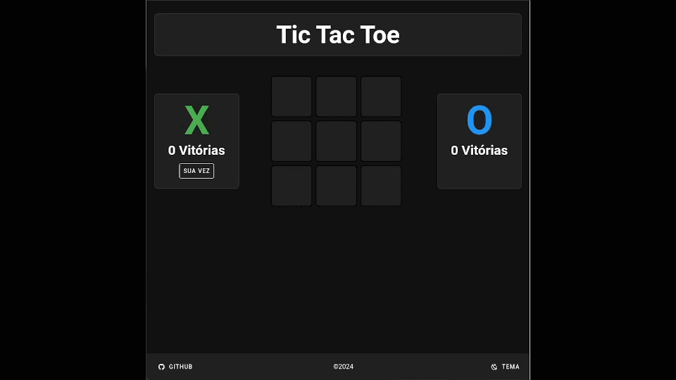

# TIC-TAC-TOE
Classic game constructed with [Vue 3](https://vuejs.org/guide/introduction.html), [Vite](https://vitejs.dev/) e [Vuetify Component 3](https://vuetifyjs.com/en/)

Based on work of [Sushil Kamble](https://github.com/sushil-kamble), backend untouched.

## Download
No terminal clone o projeto:
```
git clone https://github.com/zapsys/tic-tac-toe.git
```

## Project setup
Entre na pasta do projeto e execute o commando para instalar as dependências
```
cd tic-tac-toe
```
```
npm install
```

## Execute for development with hot-reload
```
npm run dev
```
Acesse a url http://localhost:5173 no navegador.

## Build for production
```
npm run build
```
Então execute:
```
npm run serve
```

Acesse a url http://localhost:4173 no navegador.

## Demo
[Tic-Tac-Toe](https://tic-tac-toe-vuejs.onrender.com/)



## License
Este projeto está sob a licença MIT, que permite o download, execução, alteração, redistribuição, tanto para uso privado como comercial do código fonte, desde que citado o autor. 

[MIT License](LICENSE.md)
